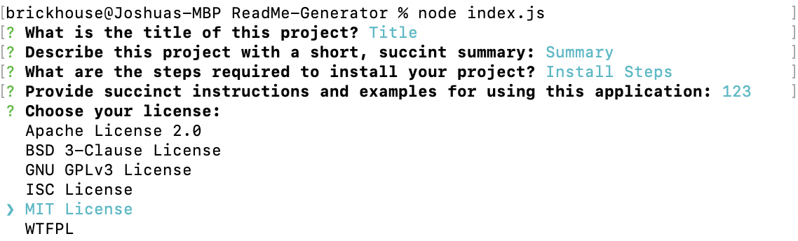
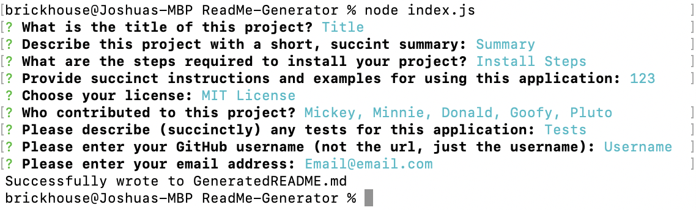
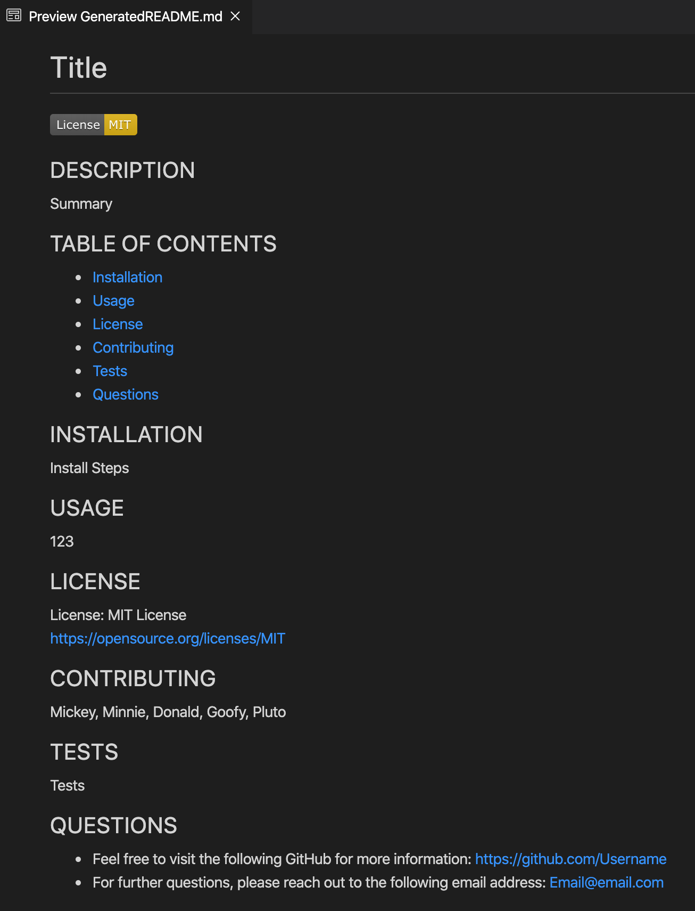

# Read Me Generator

## DESCRIPTION
A node.js command-line application that generates README files for publication on GitHub.

## SCREENSHOTS
### In-progress app usage

### Completed app usage

### Generated README

## TABLE OF CONTENTS
* [Installation](#installation)
* [Usage](#usage)
* [License](#license)
* [Contributing](#contributing)
* [Tests](#tests)
* [Questions](#questions)
    
## INSTALLATION
- Clone the repo for use on your local machine
- Use the command line to locate the cloned repo and make it your current directory
- Type `npm install` in the command line
- This will install the node module packages and dependencies, including inquirer, which is necessary for proper application functionality

## USAGE
- To use the "Read Me Generator" Application...
- Use the command line to locate the clone repo and make it your current directory
- Simply type `node index.js` in the command line
- A series of prompts will inquire about the following items:
    - What is the title of this project?
    - Describe this project with a short, succint summary:
    - What are the steps required to install your project?
    - Provide succinct instructions and examples for using this application:
    - Choose your license:
    - Who contributed to this project?
    - Please describe (succinctly) any tests for this application:
    - Please enter your GitHub username (not the url, just the username):
    - Please enter your email address:
- After all the inquiries have responses, the program generates a README file

## LICENSE
License: MIT License 
[https://opensource.org/licenses/MIT](https://opensource.org/licenses/MIT)

## CONTRIBUTING
[https://github.com/JPBrickhouse](https://github.com/JPBrickhouse)

## TESTS
Link to video showing successfully deployed application:

## QUESTIONS
- Feel free to visit the following GitHub for more information:
[https://github.com/JPBrickhouse](https://github.com/JPBrickhouse)
- For further questions, please reach out to the following email address:
[Email@email.com](Email@email.com)
